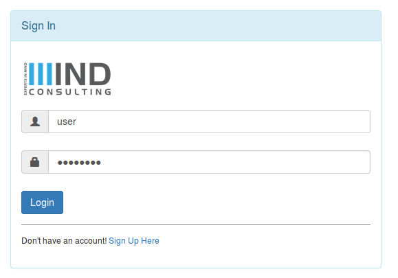
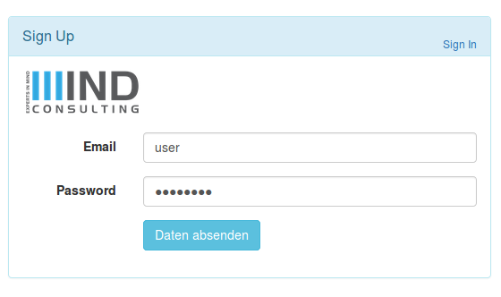

# spring-boot-security-u2f

This is a demo showing U2F authentication together with Spring Security.

Usage: clone the project, cd into root and run ```mvn spring-boot:run```

Now visit [https://localhost:8443](https://localhost:8443)




